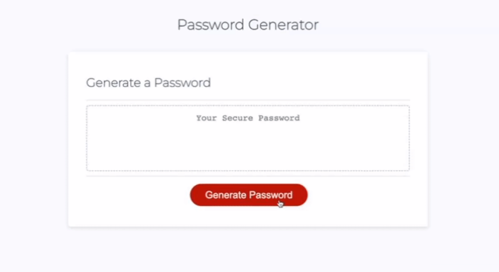

# Generator-of-Password
Coding Bootcamp Third Module Challenge: Creating a password generator with JavaScript

# Description
For this project I have implemented the window prompt function to ask the user 5 questions to determine the users preference. 

# Deployed Application Page
https://baelindsay.github.io/Generator-of-Password/

# Project GIF
  